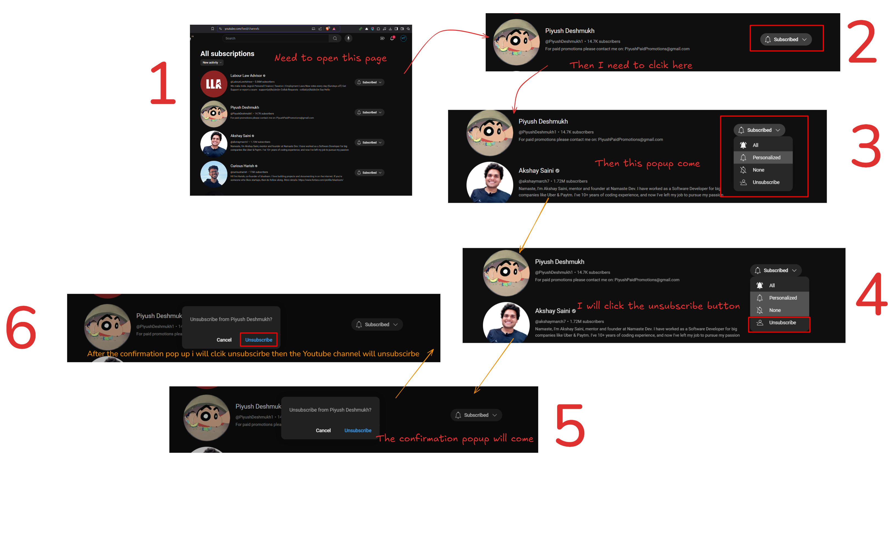

# YouTube Easy Unsubscriber

A Chrome extension that simplifies the YouTube unsubscription process by adding a quick unsubscribe button next to the subscribe button.

## 🌟 Features

### Current Features

- **Quick Unsubscribe Button**: One-click unsubscribe without confirmation dialogs
- **Modern UI**: Sleek design with smooth animations
- **Time-Saving**: Eliminates YouTube's default multi-step unsubscribe process

### Upcoming Features

- **Global Unsubscribe Button**: Adding unsubscribe button on all YouTube pages where channel content appears
- **Multi-Channel Selection**: Select multiple channels and unsubscribe from them simultaneously

## 🔍 The Problem

YouTube's default unsubscription process requires multiple steps:

1. Click the "Subscribed" button
2. Click "Unsubscribe" in the dropdown
3. Confirm unsubscription in a dialog

This becomes tedious when managing multiple subscriptions.



1. Default YouTube subscription page
2. Click "Subscribed" button
3. Wait for dropdown
4. Click "Unsubscribe"
5. Wait for confirmation dialog
6. Confirm unsubscription

## 💡 The Solution

This extension streamlines the process by:

- Adding a direct "Unsubscribe" button next to the subscribe button
- Automatically handling all confirmation steps
- Providing visual feedback for the unsubscribe action
- Maintaining YouTube's native look and feel

## 🚀 Local Setup

1. **Clone the Repository**

   ```bash
   git clone https://github.com/yourusername/youtube-easy-unsubscriber.git
   cd youtube-easy-unsubscriber
   ```

2. **Load the Extension in Chrome**

   - Open Chrome and navigate to `chrome://extensions/`
   - Enable "Developer mode" in the top right
   - Click "Load unpacked"
   - Select the extension directory you just cloned

3. **Test the Extension**

   - Go to [YouTube Subscriptions Page](https://www.youtube.com/feed/channels)
   - You should see the new unsubscribe button next to each channel's subscribe button
   - For batch unsubscribe, use the popup menu from the extension icon

4. **Development**
   - Make changes to the code
   - Click the refresh icon in `chrome://extensions/` to update the extension
   - Test your changes on YouTube

## 🛠️ Technical Details

The extension uses:

- Chrome Extension Manifest V3
- Content Scripts for DOM manipulation
- Custom CSS for seamless UI integration
- Event listeners for button interactions

## 🎨 UI Components

- Quick Unsubscribe Button
  ```css
  .quick-unsub-btn {
    background: linear-gradient(135deg, #ff4b4b, #ff6b6b);
    /* Modern styling with hover effects and animations */
  }
  ```
- Loading State Animation
  ```css
  @keyframes pulse {
    0% {
      opacity: 0.6;
    }
    50% {
      opacity: 0.8;
    }
    100% {
      opacity: 0.6;
    }
  }
  ```

## 📝 Usage

1. Navigate to YouTube's subscription page
2. Find the channel you want to unsubscribe from
3. Click the new "Unsubscribe" button next to the subscribe button
4. The extension handles the rest automatically

## 🔧 Troubleshooting

- **Button Not Appearing**: Refresh the page or disable/enable the extension
- **Unsubscribe Not Working**: Make sure you're logged into YouTube
- **Extension Not Loading**: Check if Developer mode is enabled in Chrome extensions

## 📄 License

This project is licensed under the MIT License - see the LICENSE file for details.
